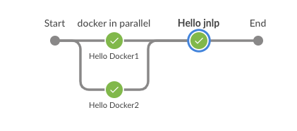

# Multi-agent running on same VM

## Background
A customer requested if it possible to to set up multiple agents on the same VM. The only interest is to setup dedicated agents and (build queues) to handle priority traffic. This can only be achieved "reliably" by using Docker containers.

## Setup
* Create the two agents on the master.
  * one is called `docker_agent_1` with label `docker1`
  * the second is called `docker_agent_2` with label `docker2`
  * the `remote root directory` is set to `/home/jenkins`
  * the launch method must be set to `Launch agent by connecting it to the master` (jnlp initiated from the agent)
* on the VM (where Docker is running)
  * create directories (while root) called `/home/docker_agent1` and `/home/docker_agent2`
  * create a startup script in each directory with `docker run jenkins/jnlp-slave -url http://ec2-3-88-222-36.compute-1.amazonaws.com 28ba5709f0c6671e4814c3b692682f645ca5fec66eb9bad45ff86b6912913fb3 docker_agent_2`.
  * the secret can be retrieved in the agent configuration page that is accessible via the `manage jenkins` page when not yet connected. It can be retrieved programmatically as explained in [this KB article](https://support.cloudbees.com/hc/en-us/articles/222520647-How-to-find-slave-secret-key-). 
  * when executed, this command will start the JNLP agent. It will then automatically connect to the master.

## Usage
* this setup was tested with the following pipeline :

```
pipeline {
   agent none 

   stages {
      stage('docker in parallel') {
        parallel {
            stage('Hello Docker1') {
                agent { node { label 'docker1' } }
                steps {
                    echo "Hello World from node \"${env.NODE_NAME}\""
                }
            }
            stage('Hello Docker2') {
                agent { node { label 'docker2' } }
                steps {
                    echo "Hello World from node \"${env.NODE_NAME}\""
                }
            }
        }      
      }
      stage('Hello jnlp') {
         agent { node { label 'jnlp' } }
         steps {
            echo "Hello World from node \"${env.NODE_NAME}\""
         }
      }      
   }
}
```

This results in the following pipeline:




## Open questions
* What is the difference between `remote root directory` and the `workdir`?
* What is the recommended/best practice to connect an agent? JNLP? SSH? Initiation from Agent? from Master?
* how does the communication work? Is everything shared on the same port? What should the firewall ports be set to?

## References
* https://support.cloudbees.com/hc/en-us/articles/115001771692-How-to-Create-Permanent-Agents-with-Docker
* https://hub.docker.com/r/jenkins/jnlp-slave/
